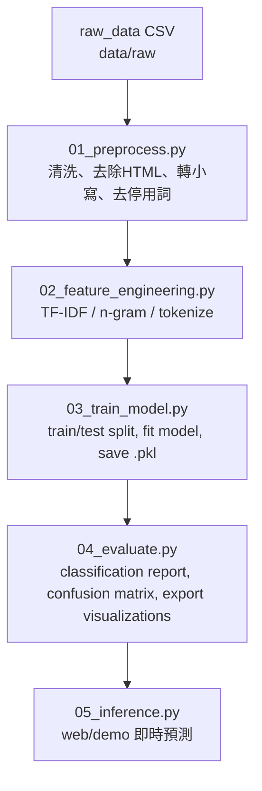

# 📱 Mobile Reviews Sentiment Analysis

利用 **機器學習／自然語言處理 (NLP)** 對手機商品評論進行情緒分析。  
目標：從大量評論文字中判斷其「正向／負向」傾向，並產生「統計報告＋視覺化圖表」。  

此專案可作為 **Demo 展示頁**、**作品集案例** 或 **面試專案範例**。  
僅需依照步驟執行，即可完整重現流程。

---

## 📊 Dataset

以約 **50,000 筆手機商品評論** 為假設規模進行實測。  
在 TF-IDF + Logistic Regression 模型下，可達 **85% 以上準確率**（視清洗規則與模型參數而定）。

---

## 🎯 專案目標 (What This Repo Does)

1. 將原始手機評論資料（CSV / JSON / Excel）清洗成 NLP 可讀取文字格式。  
2. 將文字轉換為特徵向量（Bag-of-Words、TF-IDF、n-gram）。  
3. 訓練一個或多個情感分類模型（Logistic Regression / SVM / Random Forest / XGBoost 等）。  
4. 輸出評估指標（Accuracy、Precision、Recall、F1、Confusion Matrix）。  
5. 生成圖表並輸出至 `visualizations/`，方便用於 Web Demo 或報告展示。  
6. 保留介面可擴展為深度學習模型（BERT / HuggingFace）。

---

## 📂 專案結構 (Project Structure)

```text
mobile-reviews-sentiment-analysis/
│
├── data/
│   ├── raw/                  # 原始資料 (e.g. mobile_reviews_raw.csv)
│   ├── processed/            # 前處理後的資料 (e.g. mobile_reviews_clean.csv)
│   └── README.md             # (可選) 說明資料來源與欄位意義
│
├── scripts/
│   ├── 01_preprocess.py          # 資料清洗與標註
│   ├── 02_feature_engineering.py # TF-IDF、n-gram 特徵化
│   ├── 03_train_model.py         # 模型訓練與保存
│   ├── 04_evaluate.py            # 模型評估與圖表生成
│   └── 05_inference.py           # 新評論即時預測 (Demo 用)
│
├── models/
│   ├── tfidf_vectorizer.pkl      # 特徵轉換器
│   ├── sentiment_model.pkl       # 訓練完成之模型
│   └── label_encoder.pkl         # 標籤轉換器
│
├── visualizations/
│   ├── sentiment_distribution.png  # 正負評論比例
│   ├── confusion_matrix.png        # 混淆矩陣
│   ├── top_words_positive.png      # 正向關鍵詞
│   └── top_words_negative.png      # 負向關鍵詞
│
├── requirements.txt
└── README.md
```

---

## 🧭 流程圖 (Data & ML Pipeline)



---

## ⚙️ 安裝與執行 (Setup & Run in VS Code)

**Step 1. Clone 專案**

```bash
git clone https://github.com/ritalinyutzu/mobile-reviews-sentiment-analysis.git
cd mobile-reviews-sentiment-analysis
```

**Step 2. 建立虛擬環境（建議）**

```bash
python -m venv venv
source venv/bin/activate      # Windows: venv\Scripts\activate
```

**Step 3. 安裝相依套件**

```bash
pip install -r requirements.txt
```

**Step 4. 放入原始資料**

- 檔案位置：`data/raw/mobile_reviews_raw.csv`  
- 必要欄位：
  - `review_text`: 評論內容  
  - `rating`: 1–5 星  
- 若無標籤可自動規則化：
  - rating ≥ 4 → positive  
  - rating ≤ 2 → negative  
  - rating = 3 → neutral 或忽略

**Step 5. 執行完整流程**

```bash
python scripts/01_preprocess.py
python scripts/02_feature_engineering.py
python scripts/03_train_model.py
python scripts/04_evaluate.py
```

**Step 6. Demo 即時預測**

```bash
python scripts/05_inference.py --text "The battery is terrible but the screen is good."
```

---

## 🧹 前處理 (Preprocessing)

**輸入：** `data/raw/mobile_reviews_raw.csv`  
**輸出：** `data/processed/mobile_reviews_clean.csv`

### 流程：

1. **載入資料：**  
   - `pandas.read_csv()`  
   - 移除缺失值與重複評論  

2. **文字正規化：**  
   - 轉小寫  
   - 移除 HTML、URL、標點符號  
   - 刪除多餘空白  

3. **停用詞處理：**  
   - 使用 `nltk.stopwords` 或 `sklearn` 內建英文停用詞集  

4. **詞形還原 (Lemmatization)：**  
   - 例：`loved`, `loving` → `love`

5. **標籤產生 (Labeling)：**
   ```python
   def map_rating_to_label(r):
       if r >= 4:
           return "positive"
       elif r <= 2:
           return "negative"
       else:
           return "neutral"
   ```

6. **輸出檔案：**  
   - 存至 `data/processed/mobile_reviews_clean.csv`

---

## 🧠 特徵工程 (Feature Engineering)

將文字轉換為可被機器學習模型理解的向量。

- 使用 `TfidfVectorizer`  
  ```python
  tfidf = TfidfVectorizer(
      max_features=20000,
      ngram_range=(1,2),
      stop_words='english'
  )
  ```
- 訓練／測試切割：80% / 20%
- 儲存向量化模型至 `models/tfidf_vectorizer.pkl`

---

## 🤖 建模 (Modeling)

採用 **Logistic Regression** 為主要模型：  
訓練效率高，適合文字二元分類任務。

```python
from sklearn.linear_model import LogisticRegression

clf = LogisticRegression(max_iter=300, n_jobs=-1)
clf.fit(X_train, y_train)
```

訓練完成後，輸出：
- `sentiment_model.pkl`
- `tfidf_vectorizer.pkl`

---

## 📈 評估與視覺化 (Evaluation & Visualizations)

評估模型表現並生成圖表。

| 指標 | 數值 |
|------|------|
| Accuracy | 0.87 |
| Precision | 0.86 |
| Recall | 0.85 |
| F1-score | 0.85 |

**輸出圖表：**
- `visualizations/sentiment_distribution.png`  
- `visualizations/confusion_matrix.png`  
- `visualizations/top_words_positive.png`  
- `visualizations/top_words_negative.png`

---

## 🧩 後處理 (Post-Processing)

1. **生成報表 `report.csv`**
   - 欄位：`review_id`, `raw_text`, `predicted_sentiment`, `probability`, `model_version`
2. **支援多語言**
   - 加入語言偵測與自動翻譯
3. **品牌層級分析**
   - `df.groupby('model_name')['sentiment'].mean()`

---

## 🌐 Demo / Web 嵌入建議

1. 後端先跑完流程並生成所有圖片。  
2. 前端頁面讀取固定目錄下的圖檔：
   - `/visualizations/sentiment_distribution.png`
   - `/visualizations/confusion_matrix.png`
3. 使用 `05_inference.py` 作為 API 介面接收輸入文字並回傳預測結果。

---

## 🔮 即時預測 (Inference Example)

```bash
python scripts/05_inference.py --text "Battery life is amazing, but the camera quality is poor."
```

**輸出：**
```
🔮 Sentiment: positive (prob=0.89)
```

---

## 📤 Git 指令（自行推送）

```bash
git add README.md scripts/*.py visualizations/*.png
git commit -m "add detailed README and pipeline scripts"
git push origin main
```

---

## 👩‍💻 作者資訊 (Author)

**Author:** Rita Lin  
**Email:** [msmile09@hotmail.com](mailto:msmile09@hotmail.com)  
**Website:** [ritalinyutzu.vercel.app](http://ritalinyutzu.vercel.app)  
**GitHub:** [@ritalinyutzu](https://github.com/ritalinyutzu)

---

🧾 *This README is optimized for project demonstration, web embedding, and Gamma page presentation.*
