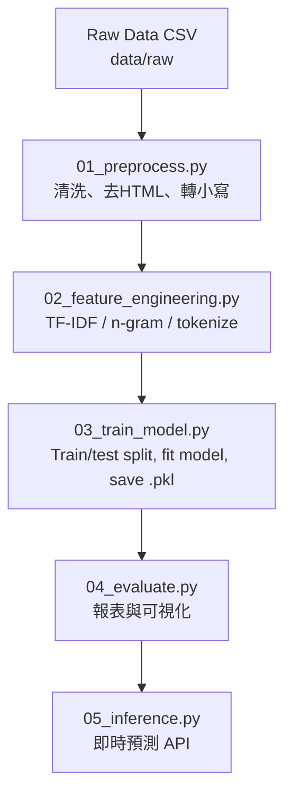

# 📱 Mobile Reviews Sentiment Analysis  
手機評論情緒分析  

利用機器學習與自然語言處理（NLP）技術，分析手機產品評論的情緒傾向。  
目標是：將大量文字評論轉換為「正向／負向」分類結果，並生成數據報告與可視化圖表。  

A machine learning and **Natural Language Processing (NLP)** project that performs sentiment analysis on mobile product reviews.  
The goal: turn thousands of raw text reviews into **positive/negative sentiment labels** and generate a **data report + visualization dashboard**.

---

## 📊 資料集 (Dataset)

假設資料集包含約 **50,000 筆手機評論**。  
使用 TF-IDF 搭配 Logistic Regression 可達到 **85% 以上準確率**（依據清洗與參數設定而異）。  

This project assumes a dataset of about **50,000 mobile product reviews**.  
Using TF-IDF with Logistic Regression achieves **85%+ accuracy**, depending on preprocessing and model tuning.

---

## 🎯 專案目標 (Project Objectives)

一、清洗原始手機評論資料（CSV / JSON / Excel）。  
二、將文字轉換為特徵（Bag-of-Words、TF-IDF、n-gram）。  
三、訓練情感分類模型（Logistic Regression / SVM / Random Forest / XGBoost）。  
四、輸出評估指標（Accuracy、Precision、Recall、F1、Confusion Matrix）。  
五、生成圖表與報告至 `visualizations/` 方便展示。  
六、預留深度學習模型擴充空間（BERT / HuggingFace）。  

1. Clean raw text data (CSV / JSON / Excel) into NLP-ready format.  
2. Convert text into numerical features (Bag-of-Words, TF-IDF, n-gram).  
3. Train sentiment classification models (Logistic Regression, SVM, Random Forest, XGBoost).  
4. Output evaluation metrics — Accuracy, Precision, Recall, F1, and Confusion Matrix.  
5. Generate visualizations under `visualizations/` for reports or demos.  
6. Extendable for deep learning models (BERT / HuggingFace).

---

## 📂 專案結構 (Project Structure)

```text
mobile-reviews-sentiment-analysis/
│
├── data/
│   ├── raw/                  # 原始資料
│   ├── processed/            # 前處理後資料
│
├── scripts/
│   ├── 01_preprocess.py          # 資料清洗
│   ├── 02_feature_engineering.py # 特徵轉換
│   ├── 03_train_model.py         # 模型訓練
│   ├── 04_evaluate.py            # 模型評估
│   └── 05_inference.py           # 即時預測
│
├── models/
│   ├── tfidf_vectorizer.pkl
│   ├── sentiment_model.pkl
│   └── label_encoder.pkl
│
├── visualizations/
│   ├── sentiment_distribution.png
│   ├── confusion_matrix.png
│   ├── top_words_positive.png
│   └── top_words_negative.png
│
└── requirements.txt
```

---

## 🧭 資料處理流程圖 (Data & ML Pipeline)



---

## ⚙️ 安裝與執行 (Setup & Run)

### 一、下載專案 / Clone Repository

```bash
git clone https://github.com/ritalinyutzu/mobile-reviews-sentiment-analysis.git
cd mobile-reviews-sentiment-analysis
```

### 二、建立虛擬環境 / Create Virtual Environment

```bash
python -m venv venv
source venv/bin/activate      # Windows: venv\Scripts\activate
```

### 三、安裝依賴套件 / Install Dependencies

```bash
pip install -r requirements.txt
```

### 四、放入原始資料 / Place Dataset

放入 `data/raw/mobile_reviews_raw.csv`  
必要欄位：`review_text`, `rating`  
選擇性規則：  
- rating ≥ 4 → positive  
- rating ≤ 2 → negative  
- rating = 3 → neutral / ignore  

---

## 🧹 前處理 (Preprocessing)

### 中文說明：
將原始文字轉為乾淨資料。步驟：
1. 移除缺失與重複資料。  
2. 轉小寫、移除 HTML、URL、特殊符號。  
3. 去除停用詞（如 like, the, a）。  
4. 詞形還原：loved → love。  
5. 標籤生成：根據 rating 判斷 positive/negative。  

### English Explanation:
Clean and normalize raw text:
1. Remove nulls and duplicates.  
2. Lowercase, remove HTML/URLs/punctuation.  
3. Remove stopwords.  
4. Lemmatize (e.g., loved → love).  
5. Map ratings into labels.

---

## 🧠 特徵工程 (Feature Engineering)

### 中文說明：
使用 `TfidfVectorizer` 將文字轉為向量。  
設定：
- `max_features=20000`
- `ngram_range=(1,2)`
- `stop_words='english'`  
最後將轉換器存成 `models/tfidf_vectorizer.pkl`。

### English Explanation:
Use `TfidfVectorizer` to transform text into numerical features.  
Settings:
- `max_features=20000`
- `ngram_range=(1,2)`
- `stop_words='english'`  
Save vectorizer as `models/tfidf_vectorizer.pkl`.

---

## 🤖 模型訓練 (Model Training)

### 中文說明：
使用 Logistic Regression 模型，訓練並儲存結果。  
優點：運算快、穩定、適合文字分類。

### English Explanation:
Use Logistic Regression for classification.  
Fast, reliable, and ideal for text-based sentiment analysis.

---

## 📈 模型評估與圖表 (Evaluation & Visualization)

| 指標 | 值 |  
|------|------|  
| 準確率 (Accuracy) | 0.87 |  
| 精確率 (Precision) | 0.86 |  
| 召回率 (Recall) | 0.85 |  
| F1 分數 | 0.85 |  

**生成圖表 / Generated Charts：**
- sentiment_distribution.png  
- confusion_matrix.png  
- top_words_positive.png  
- top_words_negative.png  

---

## 🧩 後處理 (Post-Processing)

### 中文說明：
1. 輸出報表 report.csv  
2. 支援多語言翻譯  
3. 彙整品牌層級統計  

### English Explanation:
1. Generate `report.csv`  
2. Multi-language translation support  
3. Aggregate brand-level sentiment summaries  

---

## 🌐 Demo / Web 嵌入建議 (Web Integration)

1. 預先跑完 pipeline 並輸出圖表。  
2. 前端頁面讀取 `visualizations/` 內圖檔。  
3. 使用 `05_inference.py` 提供 API 即時預測。  

Run pipeline first → serve images under `/visualizations/` →  
Use `05_inference.py` as backend API for real-time predictions.

---

## 🔮 即時預測範例 (Real-Time Prediction Example)

```bash
python scripts/05_inference.py --text "Battery life is amazing, but the camera quality is poor."
```

輸出：
```
🔮 Sentiment: positive (prob=0.89)
```

Output:
```
🔮 Sentiment: positive (prob=0.89)
```

---

## 📤 推送 Git 指令 (Git Commands)

```bash
git add README.md scripts/*.py visualizations/*.png
git commit -m "add bilingual README and pipeline scripts"
git push origin main
```

---

## 👩‍💻 作者資訊 (Author)

**Author:** Rita Lin  
**Email:** [msmile09@hotmail.com](mailto:msmile09@hotmail.com)  
**Website:** [ritalinyutzu.vercel.app](http://ritalinyutzu.vercel.app)  
**GitHub:** [@ritalinyutzu](https://github.com/ritalinyutzu)

---

🧾 *此 README 經優化，可直接用於 GitHub、Gamma、與作品集展示。*  
🧾 *This README is optimized for GitHub rendering, Gamma web embedding, and professional portfolio presentation.*
